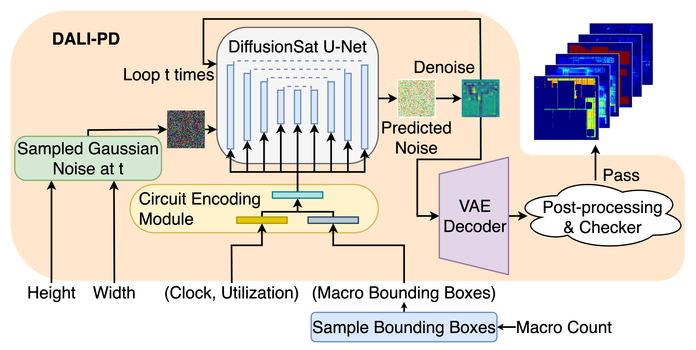

# DALI-PD
This repository contains scripts that enable the diffusion model (DALI-PD) to serve as a dataset generator for circuit heatmaps, providing 23,070 synthetic circuit heatmaps for machine learning (ML)-based physical design tasks.

## Framework Description

Over the past decade, machine learning (ML) has shown great promise across a range of physical design tasks. However, the generalizability of ML models remains limited by the availability of high-quality, large-scale training datasets. Creating such datasets is often computationally expensive and constrained by intellectual property concerns, posing a major barrier to innovation. Although public datasets have been introduced to mitigate this challenge, they tend to be static, require ongoing updates, and can take hours to generate a single data point. To address these limitations, we present DALI-PD, a scalable framework for generating synthetic layout heatmaps to accelerate ML research in physical design. DALI-PD employs a diffusion model to produce diverse layout heatmaps via fast inference, generating new data points in just seconds. This approach significantly reduces the time and cost associated with traditional dataset creation. Using DALI-PD, we have built a dataset of over 20,000 layout configurations that vary in macro count and placement. Each configuration includes synthetic heatmaps that represent critical physical design properties such as power distribution, IR drop, congestion, macro placement, and cell density. These heatmaps closely mirror the structural and statistical characteristics of real layouts, making them well-suited for training and benchmarking ML models. DALI-PD provides a scalable and practical way to create proxy data points, directly addressing the commonly community-asked question in ML for physical design: “Where will the data come from?”

## Model Weights
Model weights can be found on [Google Drive](https://drive.google.com/drive/folders/1iRH4i5ZPM_Aw37KpWN6ERDvA-TnQ4QIl?usp=sharing). After downloading, please place the two folders in [models](./models/).

## Table of Content
  - [single-heatmap.ipynb](./single-heatmap.ipynb): Python notebook that shows how to use DALI-PD to generate synthetic circuit heatmaps.
  - [models](./models): Default directory for placing the downloaded model weights.
  - [synthetic_benchmark](./synthetic_benchmark/): Contains 23,070 synthetic circuit heatmaps.
  - [src](./src/): Contains scripts for running DALI-PD.
  - [environment.yml](./environment.yml): Contains packages for building the environment.