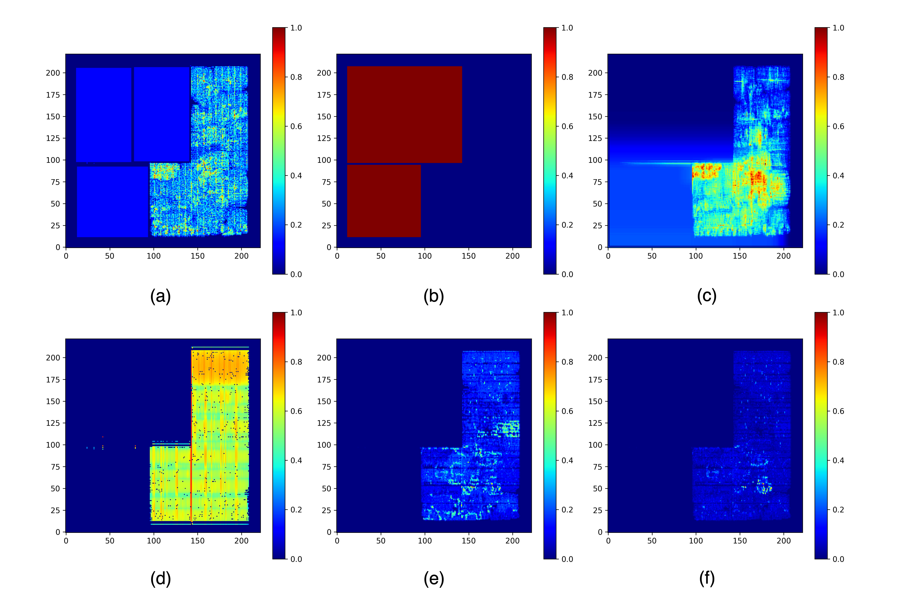

# synthetic_bnechmark

This directory contains 23,070 synthetic circuit heatmaps for the following categories:
 - [cell_density](./cell_density/): The cell density map is a distribution of the number of cells in a unit area, as shown in Fig.(a).
 - [macro_region](./macro_region/): The macro region map is a binary map that shows the regions on the chip that are occupied by macros, as shown in Fig.(b).
 - [RUDY](./RUDY/): RUDY heatmaps are used for early routing demand estimation after placement and widely adopted to estimate routing congestion. The RUDY heatmap is shown in Fig.(c).
 - [IR_drop](./IR_drop/): IR drop is the voltage drop across the chip through the power grid network. A high IR drop indicates a high potential for logic errors and timing violations. A sample heatmap for the IR drop distribution is shown in Fig.(d).
 - [power_all](./power_all/): The power heatmaps simply sum the leakage power, switching power and internal power, as shown in Fig.(e).
 - [power_sca](./power_sca/): High power values indicate high current demand, which correlates with potential IR drop when switching and internal power are scaled by toggle rate, as shown in Fig.(f).

## Naming Convention
Each set of circuit heatmaps has its own unique name in the format: {num}-u{util}-c{clock}-a{ar}.npy
 - num: index number from 0 to 23069
 - util: utilization, one of [0.9, 0.85, 0.8, 0.75, 0.7, 0.65]
 - clock: clock period in nanoseconds, one of [25.0, 20.0, 10.0, 8.0, 5.0, 2.0]
 - ar: aspect ratio, one of [1, 0.8, 1.25, 1.5, 0.66, 0.5, 2]

## Decompress
```
bash decompress.sh ./cell_density ./cell_density_restored
bash decompress.sh ./macro_region ./macro_region_restored
bash decompress.sh ./RUDY ./RUDY_restored
bash decompress.sh ./IR_drop ./IR_drop_restored
bash decompress.sh ./power_all ./power_all_restored
bash decompress.sh ./power_sca ./power_sca_restored
```