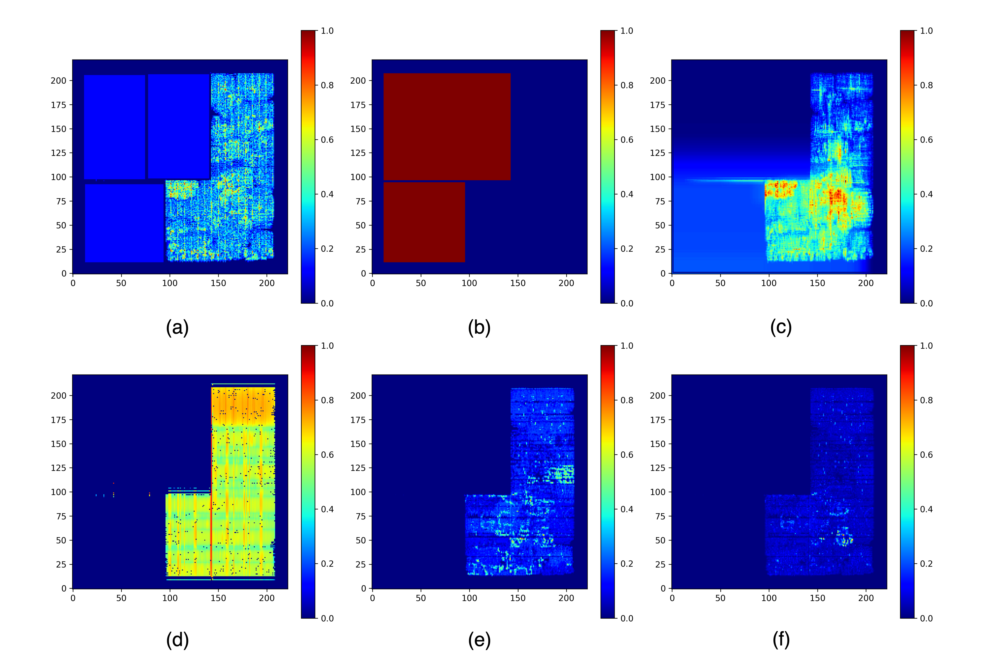

# Synthetic Benchmarks

This directory contains 23,069 synthetic circuit heatmaps for the following categories:
 - [cell_density](./cell_density/): The cell density map is a distribution of the number of cells in a unit area, as shown in Fig.(a).
 - [macro_region](./macro_region/): The macro region map is a binary map that shows the regions on the chip that are occupied by macros, as shown in Fig.(b).
 - [RUDY](./RUDY/): RUDY heatmaps are used for early routing demand estimation after placement and widely adopted to estimate routing congestion. The RUDY heatmap is shown in Fig.(c).
 - [IR_drop](./IR_drop/): IR drop is the voltage drop across the chip through the power grid network. A high IR drop indicates a high potential for logic errors and timing violations. A sample heatmap for the IR drop distribution is shown in Fig.(d).
 - [power_all](./power_all/): The power heatmaps simply sum the leakage power, switching power and internal power, as shown in Fig.(e).
 - [power_sca](./power_sca/): High power values indicate high current demand, which correlates with potential IR drop when switching and internal power are scaled by toggle rate, as shown in Fig.(f).
 - [spice](./spice/): SPICE files for each heatmap. The x and y coordinates of each segment are embedded in the filenames. For example, R0 pdn_m1_0_0 pdn_m1_4000_0 4.463529 represents a PDN segment on the M1 layer from (0, 0) to (4000, 0). The database unit (DBU) per micron is 2000.

## Naming Convention
Each set of circuit heatmap is a 2D numpy array and has its own unique name in the format: {num}-u{util}-c{clock}-a{ar}.npy
 - num: index number from 0 to 23068
 - util: utilization, one of [0.9, 0.85, 0.8, 0.75, 0.7, 0.65]
 - clock: clock period in nanoseconds, one of [25.0, 20.0, 10.0, 8.0, 5.0, 2.0]
 - ar: aspect ratio, one of [1, 0.8, 1.25, 1.5, 0.66, 0.5, 2]

## SPICE Statistics
| Metric Across Different Netlist | Min | Max | Std |
|--------|-----|-----|-----|
| Minimum Resistance (design-based) | 0.0171 | 0.0171 | 0.0 |
| Maximum Resistance (design-based) | 15 | 15 | 0.0 |
| Number of Resistance Segments | 73678 | 323928 | 46140.3089 |
| Minimum Current (design-based) | 0.0012 | 0.0082 | 0.0005 |
| Maximum Current (design-based) | 0.0142 | 0.184892 | 0.0248 |
| Number of Current Sources | 4246 | 89633 | 11470.4512 |
| Number of Voltage Sources | 4 | 15 | 1.6296 |

## Decompress
```
bash decompress.sh ./cell_density ./cell_density_decompressed
bash decompress.sh ./macro_region ./macro_region_decompressed
bash decompress.sh ./RUDY ./RUDY_decompressed
bash decompress.sh ./IR_drop ./IR_drop_decompressed
bash decompress.sh ./power_all ./power_all_decompressed
bash decompress.sh ./power_sca ./power_sca_decompressed
bash decompress.sh ./spice ./spice_decompressed
```
